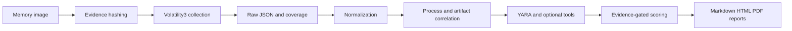

# RAMScope

RAMScope is a defensive Windows memory-forensics triage CLI built above Volatility3. Volatility extracts memory artifacts; RAMScope normalizes, correlates, prioritizes, and reports those artifacts with forensic caution.


## What RAMScope is

RAMScope is an analysis and reporting layer for authorized Windows memory-forensics work. It preserves Volatility output, records coverage and timeouts, and separates observed artifacts from leads and corroborated findings.

It is not a replacement for Volatility3, an antivirus product, or an automatic malware verdict engine. A report always requires analyst validation, and missing or timed-out evidence is reported as unassessed rather than clean.

## Architecture



## What 0.4 Changes

- High/Critical requires corroborated, independently sourced evidence. A YARA match, VAD permission, loader mismatch, network endpoint, or plugin row alone remains a lead requiring analyst validation.
- `Disabled`, unavailable values, truncated process names, and alternate Windows device paths are handled defensively.
- PEB, loader, VAD, hollowing, ghosting, thread, mutex, scheduled-task, and timeline results are interpreted by their semantic fields rather than by row presence alone.
- `malfind` scans before dumping. Targeted dump is the default, reducing avoidable timeout and disk I/O.
- `--workers auto` may run safe metadata plugins in parallel on capable systems while memory-wide scans remain serial.
- Case configuration, runtime flags, YARA rules, plugin resolution, and tool provenance are snapshotted for reproducible reassessment.
- Reassessment writes into an isolated directory and report rendering does not rerun analysis.
- Windows 10 is the current validated baseline. Windows 11 remains compatibility-ready until a clean Windows 11 image completes the acceptance suite.

## Install

```powershell
python -m venv .venv
.venv\Scripts\Activate.ps1
python -m pip install --upgrade pip
python -m pip install -e ".[dev,volatility,yara,pdf]"
```

For a clean checkout from GitHub:

```powershell
git clone https://github.com/ThanhTuanjk/RAMScope.git
cd RAMScope
.\scripts\install.ps1
```

The package can also be installed after a release with `pip install ramscope` when published to an index, or from a checked-out wheel in `dist/`. A Git URL install is:

```powershell
python -m pip install "git+https://github.com/ThanhTuanjk/RAMScope.git"
```

Optional static-analysis tools:

```powershell
python -m pip install -e ".[tools]"
```

`flare-floss` is conditionally excluded on Python 3.13 because its current transitive build dependency is not consistently available there. FLOSS remains optional and RAMScope records it as unavailable rather than failing the forensic pipeline.

## Validate the installation

```powershell
python -m compileall -q src tests
python -m pytest -q
ruff check .
mypy src
python -m build
ramscope doctor
```

## Analyze

```powershell
ramscope analyze --input C:\Dumps\memory.raw --case CASE001 --output C:\Cases --format html --deep
ramscope analyze --input C:\Dumps\memory.raw --case CASE001 --output C:\Cases --format all --full --workers auto
ramscope reassess --case C:\Cases\CASE001 --format html
ramscope report --case C:\Cases\CASE001 --format html
```

Review the generated report, the raw `raw/volatility/` output, normalized artifacts, manifests, and Evidence Coverage together. A timeout, unsupported plugin, parser rejection, or missing output leaves that behavior unassessed; it is never evidence that the host is clean.

Profiles are cumulative: `core` is the default triage set, `deep` adds broader Windows artifacts, and `full` adds the widest supported plugin plan and optional enrichment. Plugin availability still depends on the installed Volatility3 build and target image.

## Output and reassessment

Each case contains evidence metadata, immutable raw collection, normalized artifacts, optional targeted dumps, IOC views, reports, logs, and manifests. Use `ramscope reassess` to re-run the analysis layer from hash-verified raw results without rerunning Volatility or modifying the source case.

See `docs/installation.md`, `docs/usage.md`, `docs/architecture.md`, `docs/risk-scoring.md`, `docs/yara.md`, and `docs/troubleshooting.md` for details.

## Forensic limitations

RAMScope is a triage and correlation tool, not a replacement for Volatility3 or analyst validation. Clean-image and known-positive acceptance testing should be repeated whenever Volatility, Windows builds, YARA rules, scoring logic, or external-tool versions change.

